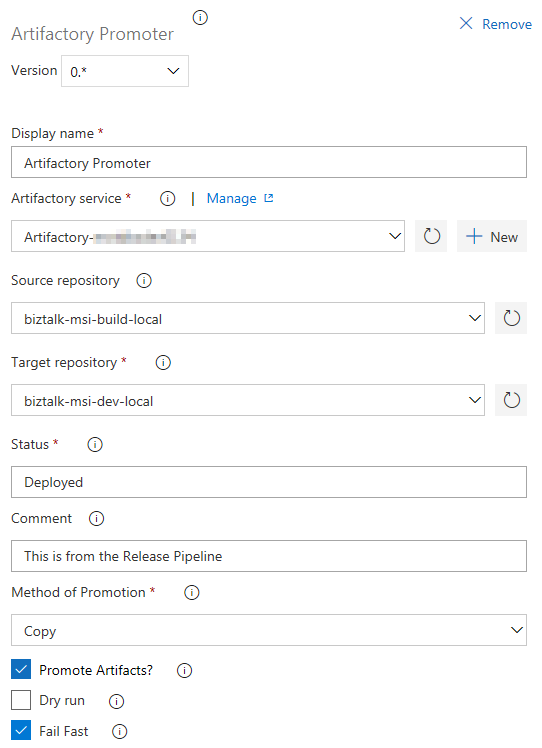
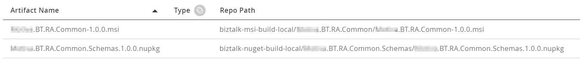
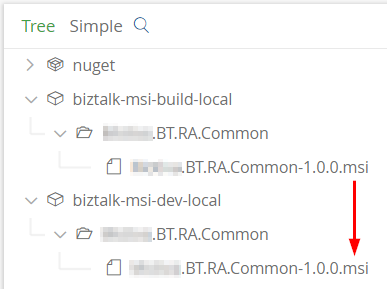
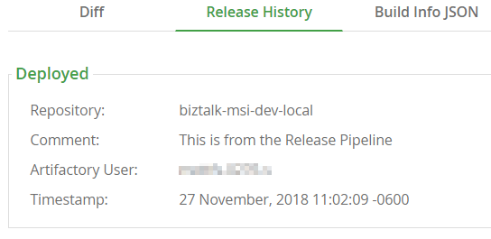
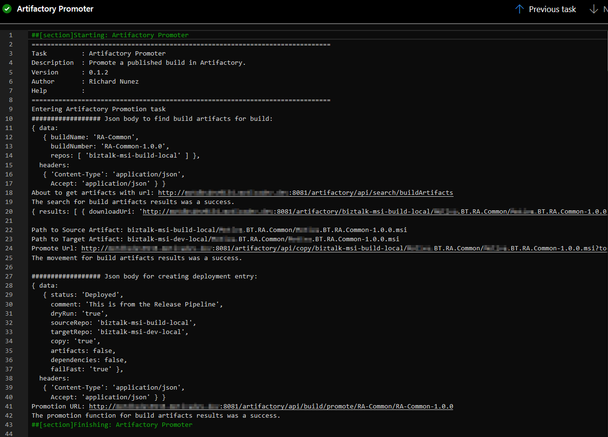

## Overview
**Artifactory Promoter** is an Azure DevOps extension that adds advance capabilities for the Artifactory promotion task only.  This tasks copies or moves artifacts from one repository to another within the same server, using the build properties associated in the Release Pipeline.  What makes this task unique is that it does not promote all of the build's artifacts, but only those for a defined source.  So in case your build produces two types of artifacts into two separate artifactory repositories, but you only want to promote one artifact type, now you can promote just that one artifact instead of both artifacts sourced from two repositories and end up in the same target repository, which is wrong.

## Documentation and Source Code
It is all here on [GitHub](https://github.com/Antebios/Artifactory-Promoter).

## Requirements
This extension depends on the "Artifactory" service connection to be present.  This is installed by the [JFrog Artifactory extension](https://marketplace.visualstudio.com/items?itemName=JFrog.jfrog-artifactory-vsts-extension).  Since the **Artifactory Promoter** extension relies on build information in the Artifactory server and that is stored using the **JFrog Artifactory** extension, then it is a safe bet to assume that the service connection exists, so my extension makes use of it (no need to create duplicate service connections).

## How to use the extension
In your Release Pipeline add a Step.  Under the "Utility" find "Artifactory Promoter" and add it to your deployment step.

1. Display name = Default is "Artifactory Promoter", but you can change it to anything.

2. Artifactory service is required.  If you are familiar with JFrog's existing extension, then it will just utilize the existing connection entry.  Click on the "Manange" link to go create a connection to your Artifactory server and enter the credentials.

3. Source repository = the source that will be search for any associated build artifacts used in the Release Pipeline.  This is required.

4. Target repository = the target Artifactory repository that the artifactory will be copied or movied to.  The folder structure placement will be kept the same.  This is required.

5. Status = A free-form text entry that you can use to define the Event or Stage of your artifact.  It can be "Deployed", "Released", "Staged", or whatever your prefer.  Default is "Deployed".

6. Comment = Another free-form text entry that you can use to give to the promotion within Artifactory.  Default is empty.

7. Method of Promotion = A dropdown list to choose from the values of either Copy or Move.  Copy will leave the original artifact in the source repository and make a duplicate copy in the target repository.  Move will remove the artifact from the source repository and place it in the target repository.  Default is Copy.

8. Promote Artifacts = Checkbox to choose if you want to just leave the artifacts in place and create a Release History in Artifactory only that is associated with the Build Information that was published during the Build Pipeline.  Default is true.

9. Dry run = Will execute all the tasks, but not copy/move any artifacts, nor create a Release History.  Default is false.

10. Fail Fast = Will fail and abort the operation upon receiving an error.  Default is true.

# What the extension does
For this example, this extension will search for the build "RA-Common", and the build number "RA-Common-1.0.0", and for any associated artifacts in the repository "biztalk-msi-build-local".  The artifacts associated with the build are these:

But the artifact returned will only be the MSI package.  Now that MSI package is **copied** to the target repository:

Notice that the directory structure is kept the same.

Now that all the artifacts have been promoted, a promotion entry is created and associated with the build in Artifactory:

If you go into your Release Pipeline and then into the logs of the release steps this will be your log

YOU ARE DONE!

## What is Artifactory

[Learn more](https://jfrog.com/artifactory/) about what a great product Artifactory can be for your organization.  Are you using a network share for your build artifact needs and it getting unwieldy? Need a place to store NuGet packages?  Need an automated process to clean-up pre-release artifacts without having you need to worry about it?  Need to secure those releases for a long time and make sure no one deletes them?  Need structure in a chaotic world?  Try Artifactory.
